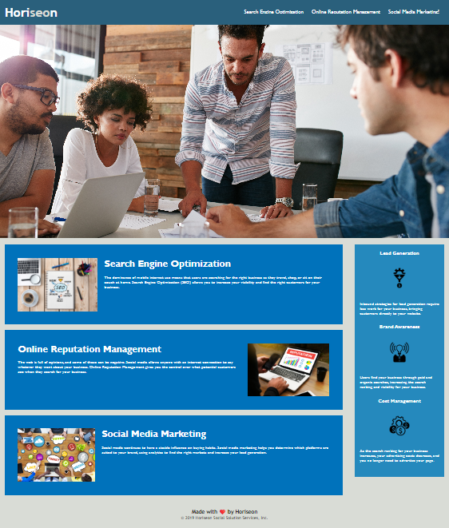

# Accessibility Challenge - Bootcamp Week 1

## Horiseon Marketing Web Page Improvements

This project aims to improve the accessibility of an existing web page. The original code has been adapted to include semantic html elements and image alt attributes. These improvements are intended to improve accessibility and user experience, as well as to ensure the page is optimised for search engines.

## Usage

Here is a mock up of the page:
    
  

## Credits

[Assignment] https://courses.bootcampspot.com/courses/3021/assignments/44723?module_item_id=832079

[Semantic HTML] https://www.w3schools.com/html/html5_semantic_elements.asp

[Image alt attributes] https://www.w3schools.com/tags/att_img_alt.asp
 
## Badges

